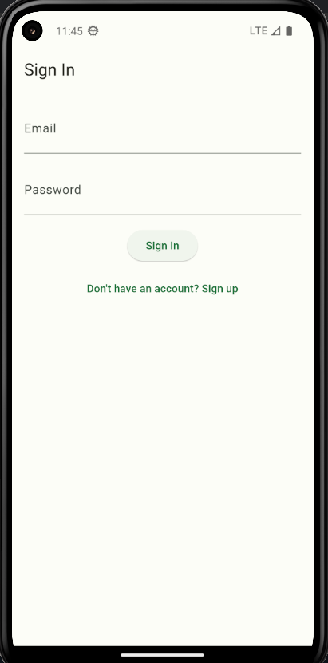

# Sustainable Habit Tracker App

Welcome to our Flutter app designed to gamify sustainability! This application helps users track their sustainable habits, participate in events, engage with the community, and manage their profiles seamlessly. Firebase is utilized as the backend to store user data securely.

## Features

### 1. SignIn/SignUp
- Dedicated SignIn/SignUp for users to access their account




### 2. Home Page and Navbar
- A friendly starting section of the app
- Users can access different sections of the app from the home page as well as the Navbar
- Users can also use the recycle facility here.


### 3. Tracker Page
- It displays users activity information.
- It also has a leaderboard that shows the top 5 leaders


### 4. Events Page
- Lists upcoming sustainability-related events, workshops, and challenges.
- Users can register for events and view details such as date, time, and location.
- Users can also host events


### 5. Community Page
- Provides a platform for users to  share tips, and discuss sustainability topics.
- Users can post updates and view other posts


### 6. Profile Page
- Allows users to manage their profile information.
- Currently minimal but with later updates more features will be added


## Installation

1. Clone the repository to your local machine:
   ```
   git clone https://github.com/your/repository.git
   ```

2. Set up Firebase:
   - Create a new Firebase project on the Firebase console (https://console.firebase.google.com/).
   - Add your Flutter app to the Firebase project and follow the setup instructions to download the `google-services.json` file.
   - Place the `google-services.json` file in the `android/app` directory of your Flutter project.

3. Install dependencies:
   ```
   flutter pub get
   ```

4. Run the app:
   ```
   flutter run
   ```

## Technologies Used

- Flutter: A cross-platform framework for building mobile applications.
- Firebase: Provides backend services such as authentication, real-time database, and cloud storage.
- Dart: The programming language used to develop Flutter apps.

## Contributing

We welcome contributions from the community to enhance the app's features, fix bugs, and improve performance. Feel free to fork the repository, make changes, and submit pull requests.
